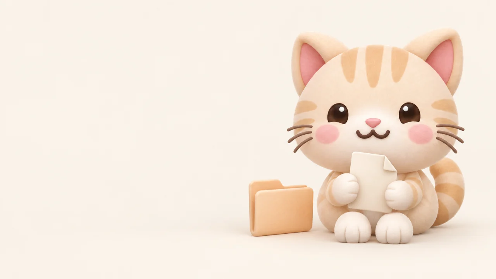
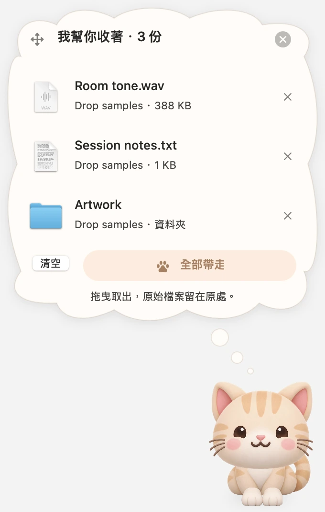

# UTUVO Drop

**檔案先交給牠，等你來帶走。**



[產品介紹與媒體素材](https://mickyyang-1407.github.io/utuvo-drop/zh-Hant/) · [English](README.md) · [編譯方式](docs/DEVELOPMENT.md)

Drop 是螢幕邊緣的一隻小貓，也是你的 macOS 檔案暫放架。
把不同資料夾的檔案先交給牠，等準備好再一起帶去下一個 App。

## 怎麼用

1. 把檔案拖到尾巴旁，小貓會跑出來迎接。
2. 放開檔案，牠會張嘴吃下圖示，肚子跟著鼓起來。
3. 思考泡泡自動展開，列出檔名、來源資料夾與大小。
4. 拖出單一項目、拉「全部帶走」，或直接拖貓咪，把檔案交給支援檔案拖放的 App。
5. 關掉泡泡，牠就躲回去；點尾巴可以再打開。

成功交出後才清掉這次的暫放參照，取消拖曳就繼續保留。



## 自行編譯

需要 macOS 14 以上、Apple Silicon，以及含 macOS SDK 的 Swift 5.9+ 工具鏈。
沒有第三方執行套件。

```bash
git clone https://github.com/mickyyang-1407/utuvo-drop.git
cd utuvo-drop
bash Scripts/build.sh
open "build/UTUVO Drop.app"
```

目前提供原始碼，本機編譯採用 ad-hoc 簽章；尚未提供 Developer ID 簽署及 Apple 公證的安裝包。

## 關於你的檔案

Drop 只在記憶體裡記住檔案位置，不另外保存內容。移除、清空或退出都不會移動或刪除原始檔案。
拖給其他 App 時，接收的 App 可能會複製或匯入它。

- 暫放清單不會跨次保存，離開或重開 App 就會清空。
- 不需要帳號，沒有分析追蹤、不連網，也不監看剪貼簿。
- 不監看全域拖曳，檔案要碰到尾巴所在區域才會觸發。
- 只接受檔案 URL，不接受文字片段或網頁連結。
- 遺失或無法讀取的檔案會標記，並阻止拖出。
- App 未啟用 sandbox，仍受 macOS 隱私權與檔案權限限制。
- 遵守系統「減少動態效果」設定。

[下載媒體素材包](https://mickyyang-1407.github.io/utuvo-drop/UTUVO-Drop-Press-Kit.zip) · [MIT 授權](LICENSE) · [問題與建議](https://github.com/mickyyang-1407/utuvo-drop/issues)
